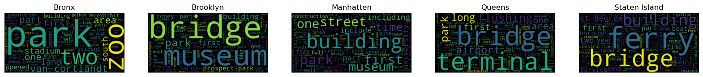

### We all know the iconic yellow taxicab from New York City. With more than 13,000 of these yellow taxis spread across five boroughs, we wanted to dwelve deeper into the underlying patters and trends within this taxi-network. More specifically, we wondered if the amount of rain has an effect on the amount tipped to the cap driver, as well as investigating from a textual analysis what factors could contribute to these patters.

>#### The Dataset: 
>We wish to investigate, how the weather, more specifically rain, may affect the tips received by yellow taxi drivers, but also use the text from wikipedia to explain, why some >places are more attractive than others in New York City.
>In this project, we have 3 data sets: TLC trip record data, weather data in New York City scraped from wunderground and text scraped from Wikipedia. Details on the data will be
>explained now:

