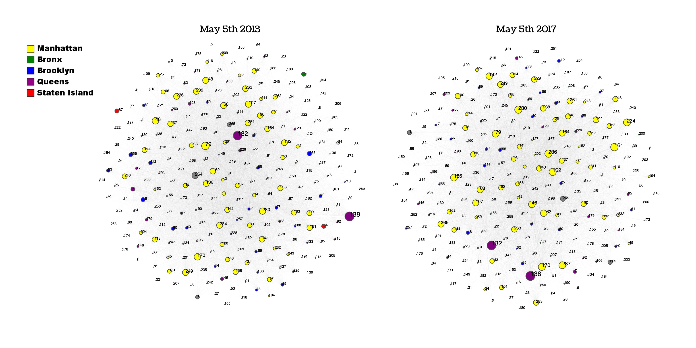
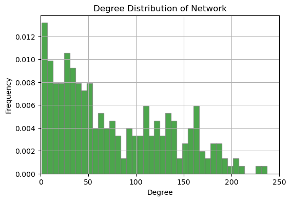
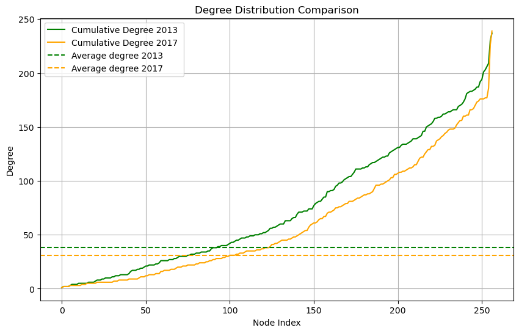
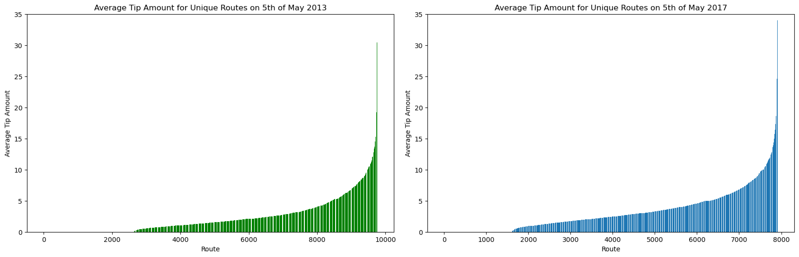

By Jesper Lund, 214639 and Frederik Bæk, s214618

### We all know the iconic yellow taxicab from New York City. With more than 13,000 of these yellow taxis spread across five boroughs, we wanted to dwelve deeper into the underlying patters and trends within this taxi-network. More specifically, we wondered if the amount of precipitation has an effect on the tip recieved by the cap driver, as well as investigating from a textual analysis what factors could contribute to the patters in the data.

> #### The Dataset:  
> The dataset consisted of three main parts; Yellow Taxi Trip Records for the five boroughs of NYC, Weather Data, and Wikipedia Pages for each of the five boroughs. The Taxi data consisted of severel million rows of trip records with information about the pickup and dropoff locations as well as the tip amount. In the Weather data, we focused on the amount of precipitation and wanted to figure out which period had the most inconsistent weather. Finally, the Wikipedia pages contained information about and descriptions of the five different boroughs of NYC.
> The different datasets can be downloaded here:  
> - [**Taxi Data**](https://www.nyc.gov/site/tlc/about/tlc-trip-record-data.page)  
> - [**Weather Data**](https://www.wunderground.com/history/daily/us/ny/new-york-city/KLGA/date)  
> - **Wikipedia:***
>   - [Bronx](https://en.wikipedia.org/wiki/The_Bronx)
>   - [Brooklyn](https://en.wikipedia.org/wiki/Brooklyn)
>   - [Manhatten](https://en.wikipedia.org/wiki/Manhattan)
>   - [Queens](https://en.wikipedia.org/wiki/Queens)
>   - [Staten Island](https://en.wikipedia.org/wiki/Staten_Island)
> 
> *See the code in the Explainer notebook for all URLs
>  
> The Taxi data was stored in parquet files, that we downloaded and then importet into a Pandas Dataframe in Python. Due to the sheer size of the dataset, with several million rows of data, we decided to only use a subpart of the total dataset to make computational tasks feasible.  
> The weather data was saved in a file called "transformed_data.json". It is a dictionary containing the years from 2013 to 2023, and each year contains the days in May 1-31, and each day has all recorded data on the given day. The amount of time stamps taken varies from day to day, but in total 9963 weather time stamps were taken between 2013 and 2023. Since we are limited to May 5th in 2013 and 2017, we will only use 84 of these weather time stamps.  
> Regarding the text data, the following is the amount of words scraped from Wikipedia about the respective borough:
>  
> **Bronx:** 65493 
>  
> **Brooklyn:** 108013 
>  
> **Manhattan:** 191659 
>  
> **Queens:** 73886 
>  
> **Staten Island:** 43905  

> #### Analysis:  
> From working with the weather data, we found out that the two days with the most variety in precipitation was the 5th of May 2013 and 2017, where 2017 had the most rainfall and 2013 the least. The taxi data from May 5th 2013 consists of roughly 490k trip records, whilst the taxi data from May 5th 2017 consists of roughly 363k trip records.
> When working with the text, the first step was to scrape the text from Wikipedia pages related to different boroughs of New York City, which we stored in a dictionary named "urls". We then sent a get-request for each URL, parsing the HTML using BeautifulSoup to extract all paragraph elements, and concatenateing the content into a large string for each borough. We then cleaned the text using a function that converts everything to lowercase, removes punctuation and stop words, which are common words that don't carry much meaning. We also added some custom stop words, primarily proper names related to each borough, as these would have dominated the wordclouds and hidden the other features. The function also tokenizes the text, meaning splitting it into individual words, and lemmatizes the words, converting each word to its base or dictionary form using the NLTK library. Finally, a word cloud for each borough is generated using the WordCloud library. This process allowed us to analyze and present information about the different boroughs of New York City based on the text of their associated Wikipedia pages. The five wordclouds are visualized in the figure below:
> 
> After inspecting the wordclouds it became evident what categorized each borough. The wordcloud for Manhatten was dominated with words like "building", "street", and "museum", while the most dominent features in the wordcloud for Queens were "bridge", "terminal", and "airport", and for Staten Island "ferry", and "bridge". These results aligned quite well with our expectations, since Manhatten is known for its assortment of streets and skyscrapers, Queens is home to the huge JFK Airport, and Staten Island is only accessible by bridge and ferry.  
>  
> The next step was to look at the two networks created for the taxi trip data for may 5th 2013 and 2017 with the tip amount as weighted edges. The networks are plotted in the figure below:
>   
> Due to the apparent similarity the two networks created have visually, it is evident that structural analysis is required to further explain this spatial network. Furthermore, there sheer amount of edges make it impossible to interfere anything with certainty based on the visual representation of the network.  
The network density provides insights about the connectivity of a network. It is calculated by computing the ratio between maximum amount of links and the actual links of a network. The maximum amount of links in our networks are calculated by ((n+1) *n)/2, where n is 257, the amount of taxi zones. This measurement is vital for this project, as the flow of taxi trips may differ due to weather and it could explain the network flow. The network density for May 5th 2013 was computed to be 0.29, whereas the network density for May 5th 2017 was computed to be 0.24. This suggests that there was more connectivity for the day with no rain.  
To further investigate if the weather affects connectivity, both networks were checked to see, whether or not they were fully connected. If one of the networks were not connected fully, then the weather may could have helped explain it. Since both networks are fully connected, the largest component of either network is equal to the network itself. This also suggests that both networks exhibit the small-world phenomenon.  
We are interested in the tips received my taxi drivers, whether or not it is affected by the weather. One aspect that may affect this is the averaged weighted shortest path in the two networks. This was computed to be 0.23 and 0.41 for the network in year 2013 and 2017 respectively. The 78% greater value for 2017 suggests that the trips during rainy days had larger tips.
> The assortativity for the networks is important to analyze, since the similarity of nodes in the network may explain the underlying structure of the network. In this report the attribute assortativity and the degree assortativity is investigated. In this setting, the attribute of interest are the boroughs. The attribute and degree assortativity for 2013 was 0.03 and -0.35 , and for 2017 was 0.03 and -0.36 respectively. The values are roughly the same, suggesting that the networks' nodes behave similarily regardless of weather. The value of 0.03 for both networks suggests that there is virtually no tendency for people to transport within their borough. This does make somewhat sense, if we look back at the wordclouds, where we saw some of the most prominent features for each borough. It seems likely that people from all over the five boroughs have to get to and from the airport in Queens fx, or visiting downtown Manhatten or the Zoo in Bronx. The degree assortativity coefficient of -0.35 and -0.36 indicates that high degree nodes tend to connect with low degrees nodes, but not to a great extent. This makes sense, as tourists are likely to visit similar places and transport between them, thus nodes of high interest will have high node degrees.
> Finally the communities were analyzed to provide some insights into how external factors such as the weather affects, what communites are formed based on tipping patterns and frequencies. In the network representing 2013, a total of 10 communites were formed, in which 6 of them only contained one node. The modularity of this network was computed to be 0.12, suggesting a weak community structure. In the network representing 2017, a total of 8 communities were formed, in which 4 contain one node and 1 community contains 3 nodes. This network has a modularity of 0.16, which is roughly 30% more than the network in 2013, suggesting that the communities in 2017 have a better community structure and internal connectivity.  
>  
> In the figure below, we see the degree distribution of the two networks:
>   
> Both distrubutions are skewed to the left, and they both appear to be multimodal since they have multiple peaks. The plot shows that the tendency for both networks is that the frequency of nodes fall with a higher degree, with the highest frequency of nodes in the interval of 0 and 50 degreees. The two networks generally seem to follow a similar distribution, but with some differences in the frequency of the degree interval.  
>  
> We also plotted the cumulative degree distribution for both network against the average degrees for both years:
>   
> We see that both the average and the cumulative degreee distribution is higher in 2013, suggesting that the taxi locations in general had a higher "connectivity" with other taxi zones in 2013.  
> In figure below we see the cumulative average tip for each unique route:
>   
> Initially the plots look very similar, but upon further inspection it is evident that there is in fact a change: in 2013, 73% of routes had tips (meaning non-zero tip values) while in 2017 that numbern had increased to 80%. (See the code section for the calculations). With more routes having non-zero tips in 2017, it seems likely that the total average of tips would be higher as well. We investigated this by calculating the total tip amount average for all the routes on the 5th of may 2013 and 2017. The result was that the average tip amount was $1.30 in 2013 and $1.89 in 2017 - a 45% increase!

