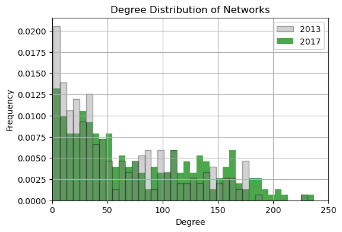

### We all know the iconic yellow taxicab from New York City. With more than 13,000 of these yellow taxis spread across five boroughs, we wanted to dwelve deeper into the underlying patters and trends within this taxi-network. More specifically, we wondered if the amount of rain has an effect on the amount tipped to the cap driver, as well as investigating from a textual analysis what factors could contribute to these patters.

#### By Jesper Lund, 214639 and Frederik Bæk, s000000

> #### The Dataset:  
> The dataset consisted of three main parts; Yellow Taxi Trip Records for the five boroughs of NYC, Weather Data, and Wikipedia Pages for each of the five boroughs. The Taxi data consisted of severel million rows of trip records with information about the pickup and dropoff locations as well as the tip amount. In the Weather data, we focused on the amount of precipitation and wanted to figure out which period had the most inconsistent weather. Finally, the Wikipedia pages contained information about and descriptions of the five different boroughs of NYC.
> The different datasets can be downloaded here:  
> - [**Taxi Data**](https://www.nyc.gov/site/tlc/about/tlc-trip-record-data.page)  
> - [**Weather Data**](https://www.wunderground.com/history/daily/us/ny/new-york-city/KLGA/date)  
> - **Wikipedia:***
>   - [Bronx](https://en.wikipedia.org/wiki/The_Bronx)
>   - [Brooklyn](https://en.wikipedia.org/wiki/Brooklyn)
>   - [Manhatten](https://en.wikipedia.org/wiki/Manhattan)
>   - [Queens](https://en.wikipedia.org/wiki/Queens)
>   - [Staten Island](https://en.wikipedia.org/wiki/Staten_Island)
> 
> *See the code in the Explainer notebook for all URLs

> #### Analysis:  
> Here we...

### The network:  
Below are the two networks from the Taxi trip data, may 5th 2013 and 2017. 

